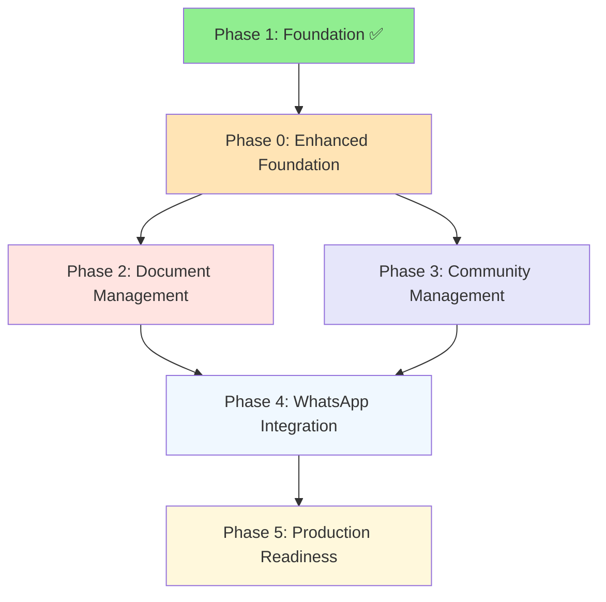

# Dependency Mapping

## 🎯 Overview

This document maps the dependencies between all phases of the Costabeach project, helping prioritize development and understand the critical path for feature delivery.

## 📊 Phase Dependency Graph



## 🏗️ Detailed Dependency Analysis

### Phase 0: Enhanced Foundation
**Dependencies**: Phase 1 (completed)
**Blocks**: All subsequent phases
**Critical Path**: Yes

```
Phase 0 Foundation Requirements:
├── Enhanced Testing Framework
│   ├── Depends on: Existing Jest + Storybook setup ✅
│   ├── Enables: All future feature testing
│   └── Blocks: Quality assurance for all phases
├── Complete Database Schema
│   ├── Depends on: Current Prisma schema ✅
│   ├── Enables: All data model implementations
│   └── Blocks: Phase 2, 3, 4 data storage
├── AI Testing Framework
│   ├── Depends on: OpenAI integration ✅
│   ├── Enables: Reliable AI feature testing
│   └── Blocks: Phase 2 (translations), Phase 4 (Q&A)
└── Background Job Infrastructure
    ├── Depends on: Inngest setup ✅
    ├── Enables: Async processing for all phases
    └── Blocks: Translation workflow, notifications
```

### Phase 2: Document Management
**Dependencies**: Phase 0
**Blocks**: Phase 4 (document-based Q&A)
**Parallel Opportunity**: Can run parallel with Phase 3

```
Phase 2 Feature Dependencies:
├── PDF Viewer Integration
│   ├── Depends on: Document upload system ✅
│   ├── Enables: In-browser document viewing
│   └── Blocks: Nothing (standalone feature)
├── Full-Text Search
│   ├── Depends on: Database schema (Phase 0)
│   ├── Enables: Document discovery
│   └── Blocks: Q&A assistant context (Phase 4)
├── AI Translation Workflow
│   ├── Depends on: AI testing framework (Phase 0)
│   ├── Depends on: Background jobs (Phase 0)
│   ├── Enables: Multilingual document access
│   └── Blocks: Nothing (enhances existing features)
└── Document Summaries
    ├── Depends on: AI translation workflow
    ├── Enables: Quick document overview
    └── Blocks: Enhanced Q&A context (Phase 4)
```

### Phase 3: Community Management
**Dependencies**: Phase 0
**Blocks**: Phase 4 (notification integration)
**Parallel Opportunity**: Can run parallel with Phase 2

```
Phase 3 Feature Dependencies:
├── Polls & Voting System
│   ├── Depends on: Database schema (Phase 0)
│   ├── Depends on: Permission system enhancement
│   ├── Enables: Community decision making
│   └── Blocks: Poll notifications (Phase 4)
├── Admin UI
│   ├── Depends on: Component library ✅
│   ├── Depends on: Enhanced permissions
│   ├── Enables: User management workflow
│   └── Blocks: Advanced user operations
├── Enhanced Permission System
│   ├── Depends on: Current RLS policies ✅
│   ├── Enables: Granular access control
│   └── Blocks: Admin operations, content management
└── Email Notifications
    ├── Depends on: Background jobs (Phase 0)
    ├── Enables: Basic notification system
    └── Blocks: WhatsApp integration patterns (Phase 4)
```

### Phase 4: WhatsApp Integration
**Dependencies**: Phases 0, 2, 3
**Blocks**: Only Phase 5
**Critical Path**: Yes (longest phase)

```
Phase 4 Feature Dependencies:
├── WhatsApp Business API
│   ├── Depends on: Notification patterns (Phase 3)
│   ├── Enables: Direct owner communication
│   └── Blocks: Q&A assistant delivery
├── Digest System
│   ├── Depends on: Email notifications (Phase 3)
│   ├── Depends on: Document summaries (Phase 2)
│   ├── Enables: Automated content delivery
│   └── Blocks: Nothing (standalone enhancement)
├── Q&A Assistant
│   ├── Depends on: Document search (Phase 2)
│   ├── Depends on: AI testing framework (Phase 0)
│   ├── Depends on: Permission system (Phase 3)
│   ├── Enables: Intelligent document assistance
│   └── Blocks: Nothing (final major feature)
└── Webhook Processing
    ├── Depends on: Background jobs (Phase 0)
    ├── Enables: Real-time WhatsApp interaction
    └── Blocks: Q&A assistant responsiveness
```

### Phase 5: Production Readiness
**Dependencies**: All previous phases
**Blocks**: Nothing (final phase)

```
Phase 5 Optimization Dependencies:
├── Performance Optimization
│   ├── Depends on: All features implemented
│   ├── Enables: Production-ready performance
│   └── Blocks: Go-live readiness
├── Security Hardening
│   ├── Depends on: All permission systems
│   ├── Enables: Production security posture
│   └── Blocks: Security compliance
├── Monitoring & Analytics
│   ├── Depends on: All features operational
│   ├── Enables: Production observability
│   └── Blocks: Operational readiness
└── Final Testing & Documentation
    ├── Depends on: All features complete
    ├── Enables: Maintainable system
    └── Blocks: Knowledge transfer
```

## 🚀 Parallelization Opportunities

### Concurrent Development Windows

**Week 2-4: Phase 2 & 3 Parallel Development**
```
Team A: Phase 2 (Document Features)
├── PDF viewer implementation
├── Search functionality
└── AI translation workflow

Team B: Phase 3 (Community Features)  
├── Polls & voting system
├── Admin UI development
└── Permission system enhancement
```

**Benefits**: 
- Reduces total timeline by 2 weeks
- Allows specialization by feature area
- Minimizes merge conflicts (different domains)

### Sequential Requirements

**Must Be Sequential**:
1. Phase 0 → All others (foundation dependency)
2. Phase 2 search → Phase 4 Q&A (context dependency)
3. Phase 3 notifications → Phase 4 WhatsApp (pattern dependency)

## 📋 Critical Path Analysis

### Longest Dependency Chain (12 weeks total)
```
Phase 0 (1 week) → Phase 4 (4 weeks) → Phase 5 (1 week) = 6 weeks
Plus Phase 2 & 3 parallel development = 3 weeks additional
Plus buffer and integration = 3 weeks additional
Total: 12 weeks
```

### Risk Mitigation
- **Phase 0 delays**: All subsequent phases blocked
- **AI integration issues**: Affects Phase 2 and 4
- **WhatsApp API limitations**: Only affects Phase 4
- **Performance issues**: Addressed in Phase 5

## 🔄 Integration Points

### Cross-Phase Integration Requirements

**Database Schema Evolution**
```
Phase 0: Complete schema definition
Phase 2: Document-related tables
Phase 3: Community-related tables  
Phase 4: WhatsApp-related tables
Phase 5: Performance optimization indexes
```

**API Surface Growth**
```
Current: Documents + Users routers ✅
Phase 2: Enhanced document operations
Phase 3: Polls + Admin routers
Phase 4: WhatsApp + Q&A routers
Phase 5: Performance + monitoring endpoints
```

**Component Library Evolution**
```
Current: Basic atomic components ✅
Phase 2: Document viewer components
Phase 3: Admin UI + poll components
Phase 4: Chat + notification components
Phase 5: Performance monitoring dashboards
```

## 📊 Resource Allocation Strategy

### Phase 0 (1 week - All hands)
- **Priority**: Critical foundation work
- **Team Size**: Full team focus
- **Risk**: High (blocks everything)

### Phase 2 & 3 (3 weeks - Parallel)
- **Priority**: Parallel development opportunity
- **Team Split**: Domain expertise allocation
- **Risk**: Medium (integration complexity)

### Phase 4 (4 weeks - All hands)
- **Priority**: Most complex integrations
- **Team Size**: Full team coordination
- **Risk**: High (external API dependencies)

### Phase 5 (1 week - All hands)
- **Priority**: Production readiness
- **Team Size**: Full team polish
- **Risk**: Low (refinement only)

## 🎯 Success Metrics by Phase

### Phase 0 Success Criteria
- [ ] Complete database schema deployed
- [ ] AI testing framework operational
- [ ] Enhanced test coverage (>95%)
- [ ] Background job infrastructure ready

### Phase 2 Success Criteria
- [ ] PDF viewer functional in all browsers
- [ ] Full-text search responsive (<200ms)
- [ ] AI translation workflow <5min processing
- [ ] Document summaries accurate and useful

### Phase 3 Success Criteria
- [ ] Polls creation and voting functional
- [ ] Admin UI supports all user operations
- [ ] Permission system granular and secure
- [ ] Email notifications reliable delivery

### Phase 4 Success Criteria
- [ ] WhatsApp integration 99% uptime
- [ ] Q&A assistant <10s response time
- [ ] Digest system automated and accurate
- [ ] Webhook processing <1s latency

### Phase 5 Success Criteria
- [ ] Application handles 300 concurrent users
- [ ] Security audit passes with no critical issues
- [ ] Monitoring provides comprehensive insights
- [ ] Documentation enables team independence

---

This dependency mapping ensures efficient development sequencing while maximizing parallel work opportunities and minimizing integration risks.